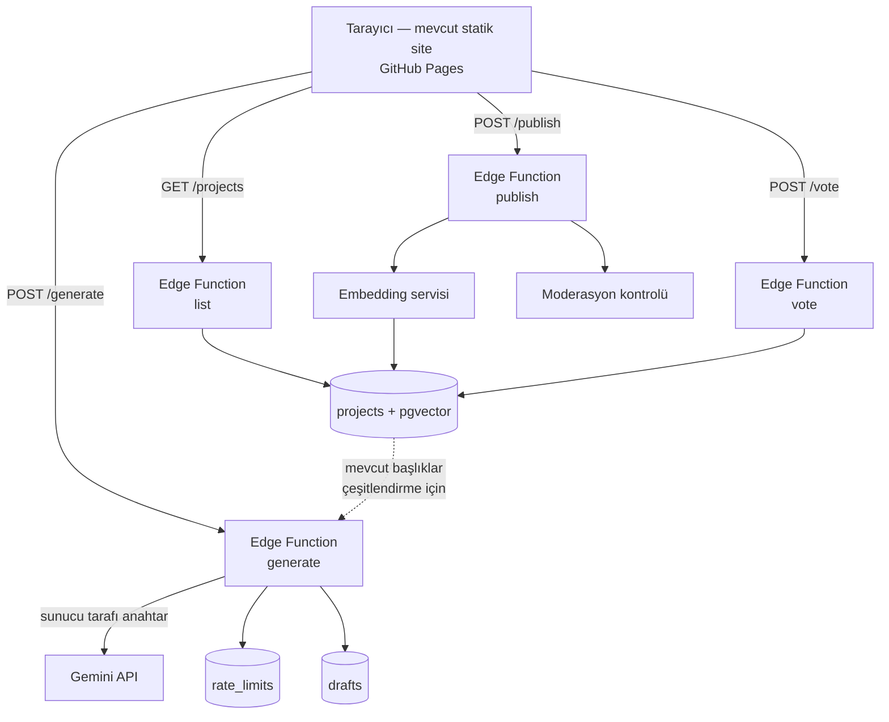

# Aetheria.ai — Dinamik Havuz Mimarisi Tasarım Dokümanı

> **Durum:** Taslak / karar bekliyor · **Tarih:** 6 Ağustos 2026
> Bu doküman kod içermez. Amacı, statik veritabanından dinamik ve paylaşımlı bir
> proje havuzuna geçişin teknik tasarımını, maliyetini ve risklerini karara
> hazır hale getirmektir.

---

## 1. Problem tespiti

Ürünün vaadi ile gerçekleşen davranışı arasında yapısal bir tutarsızlık var.

| | Vaat | Bugünkü gerçek |
|---|---|---|
| Üretim | Otonom ajan özgün proje üretir | Kullanıcı kendi API key'ini girmezse hiç AI çalışmaz; 18 elemanlı sabit listeden rastgele seçim yapılır |
| Havuz | "Ortak Proje Havuzu" | `localStorage` — hiç kimse başkasının projesini göremez |
| Büyüme | Beğenilen fikirler birikir | Hiçbir şey birikmez; tarayıcı verisi silinince sıfırlanır |

Veritabanını 6'dan 18 projeye çıkarmak bu tutarsızlığı **çözmedi, sadece
erteledi**. 18 yerine 50 proje de koysak sonuç aynı olurdu: sabit bir liste,
tanımı gereği "yenilikçi fikir keşfi" değildir.

**Kök neden tektir: sunucu tarafı yok.**
API anahtarı tarayıcıda olduğu için kullanıcıdan istenmek zorunda; veri
tarayıcıda olduğu için paylaşılamıyor. Her iki semptom da aynı eksikten doğuyor.

### 1.1 Hedef kullanıcı akışı

```
Kullanıcı siteye girer
  → Kategori seçer, "PROJE BUL"a basar
  → Sunucu Gemini ile GERÇEK bir proje üretir          (anahtar istenmez)
  → Kullanıcı beğenirse "Havuza Yayınla" der
  → Sistem benzerini arar; benzer yoksa havuza girer
  → Diğer kullanıcılar havuzu görür, oylar
  → Havuz büyüdükçe üretim prompt'u da çeşitlenir
```

---

## 2. Altyapı değerlendirmesi

Karşılaştırma, bu projenin gerçek ihtiyaçlarına göre yapılmıştır: Postgres,
vektör benzerlik araması, hafif kimlik doğrulama, sunucu tarafı sır saklama.

### 2.1 Seçenekler

| Kriter | **Supabase + Vercel** | **Cloudflare Workers** | **Kendi VPS'in** |
|---|---|---|---|
| Veritabanı | Postgres (ücretsiz katman 500 MB) | D1 / SQLite (5 GB) veya harici Postgres | Kendi Postgres'in |
| Vektör arama | `pgvector` **tüm planlarda dahil** | Ayrı ürün (Vectorize) | `pgvector` |
| Kimlik doğrulama | Dahili (GitHub OAuth hazır) | Kendin kurarsın | Kendin kurarsın |
| Satır düzeyi güvenlik | Postgres RLS, dahili | Uygulama katmanında | Postgres RLS |
| Ticari kullanım | Vercel **Hobby planı ticari kullanıma kapalı** ⚠️ | Ücretsiz planda serbest | Serbest |
| Bakım yükü | Çok düşük | Düşük | Yüksek (yama, yedek, izleme) |
| İlk kurulum süresi | ~yarım gün | ~1-2 gün | ~2-3 gün |
| Sağlayıcı kilidi | Orta (Postgres taşınabilir) | Yüksek (D1/Vectorize'a özgü) | Yok |

### 2.2 Önerim: **Supabase + Vercel**, tek uyarıyla

**Neden:** Bu projenin kritik yolu vektör benzerlik araması (tekilleştirme) ve
kimlik doğrulama. Supabase ikisini de kutudan çıkar çıkmaz veriyor; `pgvector`
ücretsiz planda dahil. Cloudflare'de aynı işi yapmak için Vectorize'ı ayrı
kurup auth'u sıfırdan yazmak gerekir — iki katı iş, aynı sonuç.

**Uyarı:** Vercel'in ücretsiz **Hobby planı yalnızca kişisel, ticari olmayan
kullanıma açıktır.** Bu proje bir portföy/açık kaynak projesi olarak kaldığı
sürece sorun yok. Para kazanmaya başlarsan Vercel Pro'ya (kişi başı aylık
$20) geçmek zorundasın. Bu maliyetten kaçınmak istersen frontend'i mevcut
haliyle **GitHub Pages'te bırakıp yalnızca API'yi Supabase Edge Functions'ta
çalıştırmak** tamamen geçerli bir alternatif — Vercel'e hiç ihtiyaç kalmaz.

> **Karar:** Supabase (veritabanı + auth + edge functions), frontend GitHub
> Pages'te kalır. Vercel yalnızca ileride SSR gerekirse devreye girer.
> Bu, ticari kullanım kısıtını tamamen ortadan kaldırır.

---

## 3. Sistem mimarisi



**Katmanlar:**

- **Frontend** — mevcut vanilla site, değişiklik minimum. `fetch` hedefleri
  Gemini yerine kendi API'mize döner. `index.html` içindeki CSP'nin
  `connect-src` direktifi Supabase alan adını içerecek şekilde güncellenir.
- **Edge Functions** — üretim, listeleme, yayınlama, oylama.
- **Postgres + pgvector** — havuz, taslaklar, oylar, gömülemeler, kota sayaçları.

### 3.1 Mevcut refactor'ün karşılığı

`core.js` zaten saf, DOM'suz ve CommonJS uyumlu. `validateProjectShape` ve
`normalizeProject` sunucuda **aynen** kullanılabilir. Bu, istemciye hiç
güvenmeden aynı doğrulamayı çalıştırmayı neredeyse bedava hale getiriyor.
PR #7'deki çekirdek ayrıştırması burada karşılığını veriyor.

---

## 4. Veri modeli

```
projects                  Yayınlanmış havuz
  id                      metin, birincil anahtar
  title, tagline          metin
  category, category_key  metin
  meta                    jsonb   (difficulty, mvpTime, monetization, opportunityScore)
  diagram_nodes           jsonb
  step1                   jsonb   (marketGap, description, tags)
  step2                   jsonb   (architecture, security)
  embedding               vector(768)   ← tekilleştirme
  author_id               uuid, null olabilir
  score                   tamsayı, varsayılan 0
  status                  enum: published | flagged | removed
  source                  enum: seed | generated
  created_at              zaman damgası

drafts                    Üretilmiş, henüz yayınlanmamış
  id, payload jsonb, session_id, created_at
  expires_at              zaman damgası   ← 7 gün sonra otomatik temizlik

votes
  project_id, voter_id, value(+1/-1), created_at
  BİRİNCİL ANAHTAR (project_id, voter_id)     ← çift oyu şemada engeller

rate_limits
  bucket_key   metin      (ip:<hash> | session:<id> | global:<gün>)
  window_start zaman damgası
  count        tamsayı
  BİRİNCİL ANAHTAR (bucket_key, window_start)

moderation_flags
  project_id, reporter_id, reason, created_at
```

**Kritik indeksler:**
- `embedding` üzerinde HNSW indeksi — benzerlik sorgusu tam tarama yapmasın.
- `(category_key, status, score DESC)` — liste sorgusunun ana yolu.
- `expires_at` üzerinde kısmi indeks — taslak temizliği.

**Satır düzeyi güvenlik (RLS):**
- `projects`: `status = 'published'` olanlar herkese okunur; yazma yalnızca
  edge function'ın servis rolüyle.
- `drafts`: yalnızca kendi `session_id`'si.
- `votes`: kendi oyunu görür ve değiştirir.

---

## 5. API uç noktaları

| Metot | Yol | Kimlik | Açıklama |
|---|---|---|---|
| `POST` | `/generate` | anonim | Kategori alır, sunucu tarafı Gemini çağrısı yapar, `drafts`'a yazar ve döner. **Havuza yazmaz.** |
| `GET` | `/projects` | anonim | Sayfalı liste. Filtre: kategori, sıralama (yeni/oy), arama. |
| `GET` | `/projects/:id` | anonim | Tek proje. |
| `POST` | `/projects` | oturum | Taslağı havuza yayınlar. Tekilleştirme + moderasyondan geçer. |
| `POST` | `/projects/:id/vote` | oturum | +1 / -1. |
| `POST` | `/projects/:id/flag` | oturum | Şikayet. |

**Sözleşme notu:** `/generate` yanıtı ile `PROJECTS_DATABASE` elemanları aynı
şemayı paylaşır. Böylece frontend'in render yolu hiç değişmez — `loadProjectIntoView`
nereden geldiğini bilmek zorunda kalmaz.

---

## 6. Üretim hattı

### 6.1 Çeşitlendirme (en kritik parça)

Prompt sabitse üretim de sabitleşir. LLM'e 100 kez "sağlık alanında proje üret"
dersen, kabaca 60'ı birbirinin varyasyonu olur. Havuz 500 satıra çıkar ama
gerçek çeşitlilik 40'ta kalır — kullanıcı yine "hep aynı şeyler" der, sadece
bu sefer 500 tanesini eleyerek.

**Önlem:** İstenen kategorideki mevcut projelerden 20 tanesinin başlığı ve tek
cümlelik özeti prompt'a **negatif örnek** olarak enjekte edilir:

> "Aşağıdaki fikirler havuzda zaten var. Bunlardan farklı bir problem alanı seç,
> aynı problemin varyasyonunu üretme: [liste]"

Statik veritabanının yeni rolü burada başlıyor — **çöp değil, tohum korpusu.**

### 6.2 Tekilleştirme

Yayınlama anında:

1. `title + tagline + step1.marketGap` metninden gömüleme (embedding) alınır.
2. `projects` tablosunda kosinüs benzerliği taranır.
3. Benzerlik **> 0.85** ise yayın reddedilir, kullanıcıya mevcut benzer proje
   gösterilir: *"Buna çok benzeyen bir proje zaten havuzda."*
4. **0.75 – 0.85** arası ise uyarı gösterilir, kullanıcı yine de yayınlayabilir.

Eşikler kalibrasyon gerektirir; ilk 200 projede elle örnekleyip ayarlanmalı.
Başlangıç değerleri tahmindir, kesin değil.

### 6.3 Küratörlük kapısı

"Beğenirsek kaydetsin" doğru sezgi, ama tek kullanıcının beğenisi kalite
sinyali değildir. Önerilen akış:

```
üretim → drafts (özel)
       → kullanıcı "Yayınla" der
       → tekilleştirme + moderasyon
       → projects (status=published, score=0)
       → topluluk oylar
       → ana listede varsayılan sıralama: oy + tazelik karışımı
```

Kötü fikirler silinmez, dipte kalır. Bu, moderasyon yükünü ciddi biçimde azaltır.

---

## 7. Güvenlik modeli

Sunucu tarafına geçiş, tehdit modelini **kökten değiştirir**. Bugün anahtar
kullanıcının; yarın senin. Bu bölüm bu yüzden en önemlisi.

### 7.1 Kötüye kullanım ve kota

Mevcut rate limit `localStorage`'da tutuluyor — tarayıcı konsolundan iki satırla
sıfırlanır. Anahtar istemcideyken bu önemsizdi (kullanıcı kendi kotasını
yakıyordu). **Sunucuya taşındığı anda kritik hale gelir.**

Gerekli katmanlar:

- **IP bazlı limit** — hash'lenmiş IP, kayan pencere.
- **Oturum bazlı limit** — çerezdeki anonim kimlik.
- **Global günlük bütçe tavanı** — bu ay ne kadar harcanacağının üst sınırı.
  Tavan dolduğunda sistem statik havuza düşer, **kapanmaz**.
- **Kendi anahtarını getir (BYOK)** — mevcut özellik korunur ve kotayı bypass
  eden opsiyonel güç kullanıcı yolu olur.

### 7.2 Kamuya açık LLM çıktısı

Havuz herkese görünür olduğu an, üretilen metin **senin sitende yayınlanan
içerik** olur. Gerekenler: yayın öncesi moderasyon kontrolü, şikayet butonu,
`status = flagged` durumunda otomatik gizleme.

XSS tarafı PR #3 ile zaten kapalı (`parseMarkdown` girdiyi escape ediyor,
render `textContent` kullanıyor) — ama bu artık **tek savunma hattı olmamalı**,
çünkü içerik artık kullanıcıdan kullanıcıya geçiyor. Sunucuda da doğrulama şart.

### 7.3 Kimlik doğrulama

- **Okuma anonim.** Kayıt duvarı koymak bu üründe ölümcül olur.
- **Yayınlama ve oylama GitHub OAuth ister.** Kayıt sürtünmesi ekleyip spam'i
  büyük ölçüde keser; hedef kitle zaten geliştirici.

### 7.4 Gemini ücretsiz katman uyarısı

Google'ın fiyatlandırma dokümanı, ücretsiz katmanda gönderilen içeriğin
**ürün geliştirme için kullanıldığını** belirtiyor. Kullanıcı girdisi işleyen
kamuya açık bir üründe bu, gizlilik politikasında açıkça yazılması gereken bir
konudur. Ücretli katmanda bu durum geçerli değildir.

### 7.5 CSP güncellemesi

`index.html` içindeki `connect-src` şu an yalnızca
`generativelanguage.googleapis.com`'a izin veriyor. Supabase alan adı
eklenmeli; BYOK yolu kaldırılırsa Google alan adı çıkarılmalı.

---

## 8. Maliyet analizi

### 8.1 Gemini (6 Ağustos 2026 fiyatları)

| Model | Girdi / 1M token | Çıktı / 1M token |
|---|---|---|
| Gemini 2.5 Flash | $0.30 | $2.50 |
| Gemini 2.5 Flash-Lite | $0.10 | $0.40 |

**Üretim başına tahmin:** prompt ~1.500 token girdi, tam blueprint ~5.000 token
çıktı (`MAX_OUTPUT_TOKENS = 8192` bunun için ayarlandı).

```
2.5 Flash:      (1.500 × 0.30 + 5.000 × 2.50) / 1M ≈ $0.0130 / üretim
2.5 Flash-Lite: (1.500 × 0.10 + 5.000 × 0.40) / 1M ≈ $0.0022 / üretim
```

| Aylık üretim | Flash ile | Flash-Lite ile |
|---|---|---|
| 1.000 | ~$13 | ~$2 |
| 10.000 | ~$130 | ~$22 |
| 100.000 | ~$1.300 | ~$220 |

**Sonuç:** Maliyet üretim sayısıyla doğrusal artıyor ve **tamamen rate limit
tasarımına bağlı.** Bütçe tavanı olmadan bu ürün açık uçlu bir fatura riskidir.
Varsayılan modelin Flash-Lite olması, "detaylı üretim" seçeneğinin ise Flash
kullanması makul bir başlangıç.

> **Not:** Ücretsiz katmanın dakika/gün başına istek limitleri artık
> fiyatlandırma dokümanında yayınlanmıyor; Google AI Studio panosundan
> kontrol edilmesi gerekiyor. Planlamayı ücretsiz katmana dayandırma.

### 8.2 Altyapı

| Kalem | Ücretsiz katman | Ne zaman yetmez |
|---|---|---|
| Supabase | 500 MB veritabanı, 5 GB egress, 50.000 aylık aktif kullanıcı, 2 proje | ~10-20 bin proje sonrası depolama; 7 gün işlemsizlikte proje duraklatılır |
| Supabase pgvector | Tüm planlarda dahil | — |
| GitHub Pages | Statik barındırma | — |
| Vercel Hobby (kullanılırsa) | 100 GB bant genişliği, 1M fonksiyon çağrısı | **Ticari kullanımda hemen** — Pro $20/kişi/ay |

**Gerçekçi başlangıç maliyeti: aylık $0 altyapı + kullanım kadar Gemini.**
Bütçe tavanını aylık $20-30'a koyarsan risk sınırlı kalır.

---

## 9. Fazlar

| Faz | Kapsam | Kazanım | Tahmini iş |
|---|---|---|---|
| **1** | Üretim proxy'si, sunucu tarafı anahtar, gerçek rate limit, bütçe tavanı | API key duvarı kalkar — **en büyük tek kazanım** | 2-3 gün |
| **2** | Postgres havuzu, salt okuma listeleme, mevcut 18 proje tohum | "Ortak havuz" gerçekten ortak olur | 2-3 gün |
| **3** | Yayınlama, tekilleştirme, oylama, moderasyon, GitHub OAuth | Havuz büyür ama çöplüğe dönmez | 4-6 gün |
| **4** | Prompt'a mevcut projeleri enjekte etme, çeşitlilik ölçümü | Üretim gerçekten çeşitlenir | 1-2 gün |

Faz 1 tek başına bile ürünün algısını değiştirir: kullanıcı siteye girip
düğmeye bastığında **gerçek AI üretimi** görür.

Faz 2 ve 3 arasında havuz salt okunur kalır; bu, moderasyon altyapısı hazır
olmadan kamuya açık yazma yolu açmamak için bilinçli bir sıralama.

---

## 10. Statik veritabanının yeni rolü

Silinmiyor. Üç işlevi devam ediyor:

1. **Çevrimdışı / bütçe tükendi fallback'i** — sistem asla boş ekran göstermez.
2. **İlk açılış tohumu** — havuz sıfır projeyle başlamaz.
3. **Çeşitlendirme korpusunun başlangıcı** (§6.1).

Bu çerçevede tezat da ortadan kalkar: 18 proje "ürünün tamamı" değil,
"havuzun ilk 18'i" olur.

---

## 11. Açık sorular ve riskler

| # | Konu | Neden önemli |
|---|---|---|
| 1 | Benzerlik eşiği (0.85) kalibre edilmemiş | Çok yüksekse kopyalar geçer, çok düşükse meşru fikirler reddedilir. İlk 200 projede elle örnekleme gerekir. |
| 2 | Gömüleme modeli seçilmedi | Gemini embedding mi, yerel bir model mi? Maliyet ve gecikme farkı var. |
| 3 | Moderasyon sağlayıcısı seçilmedi | Gemini'nin kendi güvenlik filtresi yeterli mi, ayrı bir moderasyon API'si mi? |
| 4 | Kötü niyetli oylama | Tek kişi çok hesapla oy şişirebilir. GitHub OAuth kısmen engeller; hesap yaşı eşiği gerekebilir. |
| 5 | Supabase ücretsiz planda 7 gün işlemsizlikte duraklama | Düşük trafikte proje uyur, ilk istek yavaş döner. Cron ping veya Pro plan gerekir. |
| 6 | Gizlilik politikası yok | Kullanıcı girdisi üçüncü tarafa (Google) gidiyor; ücretsiz katmanda eğitim için kullanılıyor. Yayın öncesi yazılmalı. |
| 7 | Veri taşınabilirliği | Havuz büyüdükçe Supabase'den çıkış maliyeti artar. Postgres olduğu için `pg_dump` ile taşınabilir — kilit düşük. |

---

## 12. Özet karar tablosu

| Karar | Öneri | Gerekçe |
|---|---|---|
| Barındırma | Supabase + GitHub Pages | Vercel Hobby'nin ticari kullanım kısıtından tamamen kaçınır |
| Veritabanı | Postgres + pgvector | Tekilleştirme kritik yolda; ayrı vektör servisi gereksiz karmaşıklık |
| Varsayılan model | Gemini 2.5 Flash-Lite | Üretim başına ~6 kat ucuz; Flash "detaylı mod" olarak kalır |
| Kimlik | Okuma anonim, yazma GitHub OAuth | Kayıt duvarı yok, spam kontrolü var |
| Küratörlük | Taslak → yayın → oy | Silme gerektirmeyen, ölçeklenen kalite sinyali |
| İlk adım | Faz 1 | Tek başına ürün algısını değiştirir, geri alması kolay |

---

## Kaynaklar

- [Gemini API fiyatlandırma](https://ai.google.dev/gemini-api/docs/pricing)
- [Gemini API rate limits](https://ai.google.dev/gemini-api/docs/rate-limits)
- [Supabase ücretsiz katman limitleri (2026)](https://uibakery.io/blog/supabase-pricing)
- [Vercel ücretsiz katman limitleri (2026)](https://deploywise.dev/blog/vercel-free-tier-limits-2026)
- [Cloudflare Workers limitleri](https://developers.cloudflare.com/workers/platform/limits)
