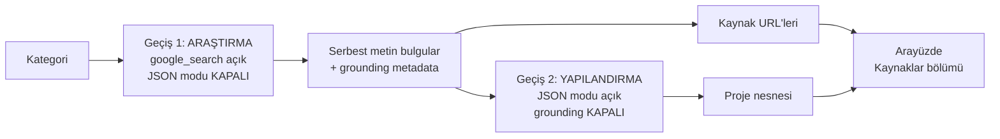

# Aetheria.ai — Gerçek Araştırma Tabanlı Üretim Tasarımı

> **Durum:** Taslak / karar bekliyor · **Tarih:** 6 Ağustos 2026
> Kod içermez. Amacı, "yapay zeka sıfırdan araştırıp proje önersin" hedefinin
> teknik karşılığını, kısıtlarını ve yapılacak işi karara hazır hale getirmektir.

---

## 1. Ürün tanımı

Ticari amacı olmayan, açık kaynak, **lokal kurulan** bir geliştirici aracı.

```
Kullanıcı kendi Gemini anahtarını girer
  → Kategori seçer, "PROJE BUL"a basar
  → Ajan web'de GERÇEK araştırma yapar (hazır veri setinden seçmez)
  → Kaynaklarıyla birlikte bir proje önerir
  → Kullanıcı beğenirse detayına iner (Aşama 2) veya kaydeder
  → Kayıt tarayıcıda (localStorage) durur
```

**Kapsam dışı — bilinçli olarak:**

| Yok | Neden |
|---|---|
| Sunucu / backend | Yapacak iş kalmıyor |
| Paylaşılan veritabanı | Kayıt lokalde yeterli |
| Giriş / kayıt / hesap | Kullanıcı ayrımı yok |
| Sunucu tarafı API anahtarı | Herkes kendi anahtarını kullanıyor |
| Oylama, moderasyon | Paylaşım olmayınca gereksiz |

Bu, projeyi **sıfır sırlı ve sıfır bağımlılıklı** tutuyor: `git clone` + herhangi
bir statik sunucu = çalışır durumda. Açık kaynak bir proje için en değerli özellik bu.

---

## 2. Mevcut durumun eleştirisi

| Hedef | Bugünkü davranış |
|---|---|
| "Sıfırdan araştırarak bulacak" | Model yalnızca eğitim verisinden **hatırlıyor**; hiçbir arama yapmıyor |
| "Hazır veri seti çekmeyecek" | Anahtar yoksa 18 elemanlı sabit listeden rastgele seçiyor |
| Şeffaflık | Sabit listeden gelen proje, AI üretimiymiş gibi sunuluyor |

Üçüncü madde asıl kusur. Liste var olduğu için değil, **ne olduğunu söylemediği
için** sorunlu. Dürüstçe etiketlendiği anda mesele kalmıyor.

---

## 3. Kritik teknik kısıt: grounding ⊗ JSON modu

"Araştırarak bulsun"un teknik karşılığı Gemini'nin **`google_search`** aracıdır
(Google Search grounding). Model arama yapar, sonuçları işler ve yanıtı kaynak
atıflarıyla döndürür.

**Ancak bu araç, yapılandırılmış çıktı modu ile aynı çağrıda kullanılamaz:**

```
Search Grounding can't be used with JSON/YAML/XML mode
→ 400 INVALID_ARGUMENT
```

Mevcut kod `generationConfig.responseMimeType = 'application/json'` kullanıyor.
Yani grounding'i eklemek tek satırlık bir değişiklik değil; üretim hattının
yeniden kurgulanması gerekiyor.

### 3.1 Çözüm: iki geçişli üretim



**Geçiş 1 — Araştırma.** Modele "şu sektörde son dönemde dile getirilen
çözülmemiş problemleri, doymuş pazarları ve kullanıcı şikayetlerini araştır"
denir. Çıktı serbest metindir ve `groundingMetadata` içinde kaynak URL'leri gelir.

**Geçiş 2 — Yapılandırma.** Birinci geçişin metni girdi olarak verilir ve mevcut
proje şemasına dönüştürülmesi istenir. Bu çağrıda arama yok, JSON modu açık.

### 3.2 Neden tek geçişte "JSON iste" denmiyor

Grounding açıkken prompt içinde JSON istemek mümkün ama güvenilmez: bildirilen
sorunlar arasında yanıtın **başının kesilmesi** (metin cümle ortasından
başlıyor) ve `groundingMetadata` alanlarının boş gelmesi var. İki geçiş hem
sağlam hem de kaynakları temiz biçimde ayrı tutuyor.

### 3.3 Beklenmedik kazanç: kanıtlanabilir araştırma

Birinci geçişin `groundingMetadata`'sı gerçek URL'ler içeriyor. Bu, arayüzde
"Bu pazar açığı şu kaynaklara dayanıyor" bölümü olarak gösterilebilir.

Ürünün "araştırıyor" iddiası böylece bir slogan olmaktan çıkıp **ekranda
doğrulanabilir** hale geliyor. Projenin en ayırt edici özelliği bu olabilir.

---

## 4. Çeşitlilik: "her seferinde farklı proje"

Grounding tek başına yetmez. Aynı kategoride arka arkaya çağrıldığında model
benzer arama sorguları üretip benzer sonuçlara varabilir. Üç katman gerekiyor:

| # | Mekanizma | Nasıl |
|---|---|---|
| 1 | **Arama çeşitlendirme** | Geçiş 1'in prompt'una dönüşümlü açı verilir: bir seferinde "regülasyon değişiklikleri", diğerinde "kullanıcı şikayetleri", diğerinde "yeni açılan pazarlar" |
| 2 | **Negatif örnekler** | Lokalde kaydedilmiş ve daha önce görülmüş proje başlıkları prompt'a "bunlardan farklı bir problem alanı seç" diye eklenir |
| 3 | **Görülenleri ele** | Örnek listeden gösterim yapılırken bu oturumda görülenler hariç tutulur |

3. madde backend gerektirmiyor ve **bugün uygulanabilir**. Şu anki
`getRandomProject` yalnızca bir önceki projeyi eliyor; görülenler kümesine
çevrilirse 18 proje = 18 farklı deneyim olur.

---

## 5. Örnek projelerin yeni rolü

`PROJECTS_DATABASE` silinmiyor, **yeniden konumlanıyor**:

| Eski | Yeni |
|---|---|
| Anahtar yokken AI üretimi gibi sunuluyordu | Açıkça **"Örnek Projeler"** olarak etiketlenir |
| Ürünün asıl içeriğiymiş gibi davranıyordu | İlk açılış vitrini + çevrimdışı yedek |
| Çeşitlilik için engeldi | Negatif örnek korpusu (§4.2) olarak üretimi çeşitlendirir |

Anahtar girilmemişken arayüz şunu söylemeli:

> *"Bunlar örnek projeler. Gerçek araştırma tabanlı üretim için ücretsiz Gemini
> anahtarını gir."*

Tezat, listenin varlığından değil sunumundan doğuyordu; bu etiketle kapanıyor.

---

## 6. Anahtar akışı (BYOK)

Anahtar zorunlu ve tek yol. Değişmesi gereken, anahtarın **nasıl sunulduğu**:

- Bugün: başlıkta küçük bir rozet, kolayca gözden kaçıyor
- Olması gereken: anahtar yokken ana eylem butonunun kendisi kurulum akışına
  yönlendirir; kurulum tek ekranda ve "30 saniye, ücretsiz" vurgusuyla

Anahtar `localStorage`'da kalmaya devam eder. Lokal kurulan kişisel bir araçta
bu kabul edilebilir; PR #3'te eklenen uyarı metni de yerinde duruyor.

---

## 7. Veri saklama

Hepsi tarayıcıda. Şema değişikliği yok, mevcut yapı yeterli:

| Anahtar | İçerik | Not |
|---|---|---|
| `aetheria_community_pool` | Kaydedilen projeler | İsim artık yanıltıcı → `aetheria_saved_projects` olmalı |
| `aetheria_gemini_key` | API anahtarı | Mevcut |
| `aetheria_seen_projects` | **Yeni** — görülen proje id'leri | §4.3 için |
| `aetheria_gemini_call_history` | Kota sayacı | Anahtar kullanıcının olduğu için artık yalnızca bilgilendirme amaçlı |

`localStorage` kotası (~5 MB) bir endişe değil: proje başına ~8 KB, yani
yüzlerce kayıt sığar. Yine de kota dolduğunda `QuotaExceededError` yakalanmalı
ve kullanıcıya anlamlı bir mesaj gösterilmeli — bugün yakalanmıyor.

---

## 8. Yapılacak işler

| # | İş | Neden | Tahmin |
|---|---|---|---|
| 1 | **İki geçişli grounded üretim** | Vizyonun çekirdeği — "araştırarak bulacak" | 1-2 gün |
| 2 | **Kaynaklar bölümü** | Araştırma iddiasını kanıtlanabilir kılar | yarım gün |
| 3 | **Görülenleri ele** | "Her seferinde farklı" — bugün uygulanabilir | yarım gün |
| 4 | **Arama açısı çeşitlendirme** | Modelin kendini tekrar etmesini engeller | yarım gün |
| 5 | **Örnek projelerin dürüst etiketlenmesi** | Asıl tezadı kapatır | yarım gün |
| 6 | **Anahtar kurulum akışının öne çıkarılması** | Anahtarsız kullanıcı ürünü hiç görmüyor | yarım gün |
| 7 | `localStorage` kota hatası yakalama | Sessiz veri kaybını önler | 1 saat |

Toplam ~3-4 gün. Backend, veritabanı ve dağıtım altyapısı gerektirmiyor.

**Sıralama önerisi:** 3 → 5 → 1 → 2 → 4 → 6 → 7.
3 ve 5 anında görünür iyileşme sağlıyor ve risksiz; 1 en büyük iş olduğu için
zemin temizlendikten sonra yapılmalı.

---

## 9. Açık sorular ve riskler

| # | Konu | Not |
|---|---|---|
| 1 | Grounding'in ücretsiz katman limitleri | Google resmi dokümanda yayınlamıyor, AI Studio panosundan bakılmalı. Üretim başına 2 çağrı + N arama sorgusu tüketiliyor. |
| 2 | İki geçiş = iki kat gecikme | Üretim süresi ~10-20 saniyeye çıkabilir. Terminal simülasyonu bunu doğal biçimde örtüyor — ama artık **sahte değil, gerçek ilerleme** göstermeli. |
| 3 | Araştırma kalitesi ölçülmedi | Grounding'in gerçekten özgün pazar açıkları bulup bulmadığı denenmeden bilinemez. Önce 1 numaralı iş için küçük bir prototip yapılıp elle değerlendirilmeli. |
| 4 | Kaynak güvenilirliği | Model düşük kaliteli kaynaklara dayanabilir. Kaynaklar kullanıcıya gösterildiği için değerlendirme ona bırakılıyor — ama bu bilinçli bir tercih olarak yazılmalı. |
| 5 | Grounding yanıt biçimi kırılganlığı | Bildirilen sorunlar (yanıt başının kesilmesi) iki geçişli tasarımla azalıyor ama tamamen ortadan kalkmıyor. Geçiş 1 çıktısı serbest metin olduğu için tolerans yüksek. |
| 6 | Örnek projeler zamanla eskir | Çevrimdışı vitrin olarak kalacaklarsa yılda bir gözden geçirilmeli. |

---

## 10. Bu dokümanın önceki sürümünden farkı

İlk taslak, paylaşılan bir Supabase havuzu, sunucu tarafı API anahtarı, kimlik
doğrulama ve dört fazlı bir dağıtım planı öneriyordu. **Tamamı kapsam dışı kaldı:**
proje ticari değil, kullanıcılar ayrıştırılmıyor, kurulum lokal ve kayıt
tarayıcıda yeterli.

Geriye kalan iş, altyapı değil **üretim kalitesi**. Doğru sorun bu; ilk taslak
yanlış sorunu çözüyordu.

---

## Kaynaklar

- [Grounding with Google Search — Gemini API](https://ai.google.dev/gemini-api/docs/google-search)
- [Grounding ve JSON modu uyumsuzluğu — Google AI geliştirici forumu](https://discuss.ai.google.dev/t/rest-api-grounding-and-json-responses-not-compatible/73101)
- [Structured output does not work with Grounding — googleapis/python-genai #665](https://github.com/googleapis/python-genai/issues/665)
- [Gemini API fiyatlandırma](https://ai.google.dev/gemini-api/docs/pricing)
